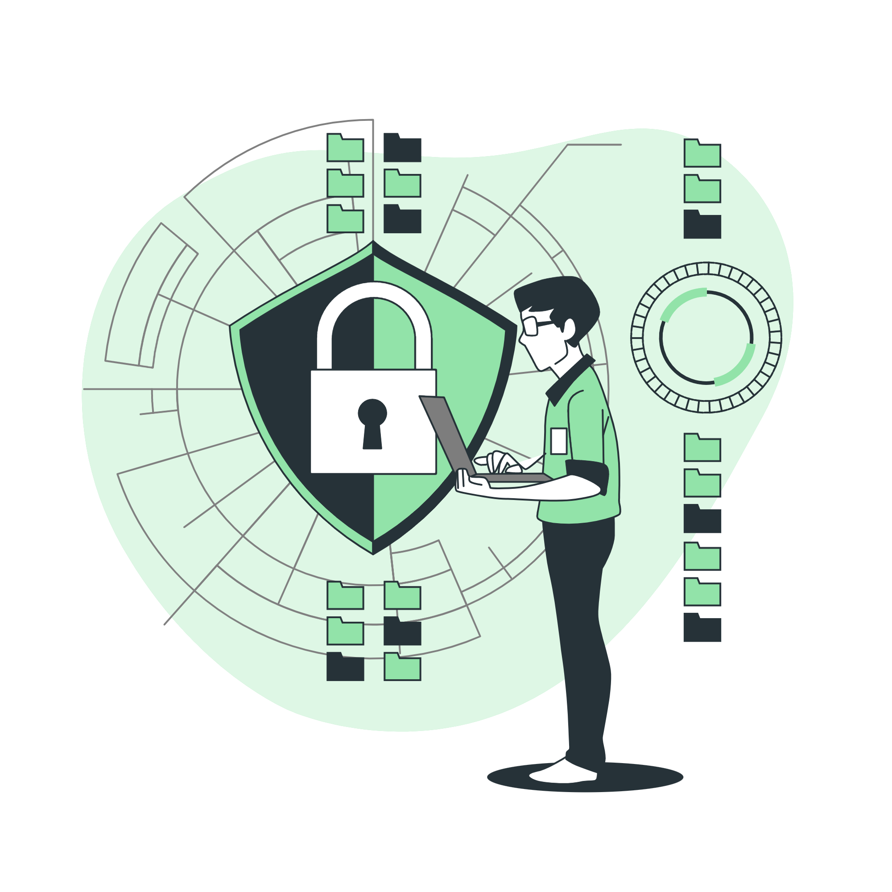

# Link Locker

Simple and secure link management website.

## Features

- Video Background
- Glassmorphism buttons
- Password protection available.

## How to Use

1. Visit [locker169.netlify.app](https://www.locker169.netlify.app).
2. Enter your URL which you want to Encrypt
3. Add a strong password 
4. Click on "Lock The URL" button
5. You will get a link and a QR code. Share it with the people you want.
6. They need Password to enter the Link

## Get Started Now!

Visit at [locker169.netlify.app](https://locker169.netlify.app) and take control of your links.

---

Thank you💖. 
